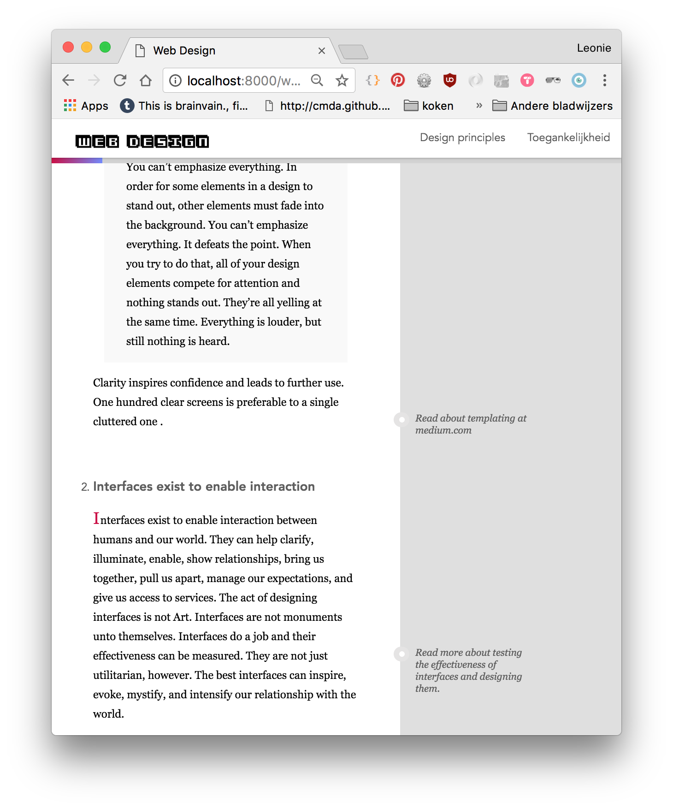
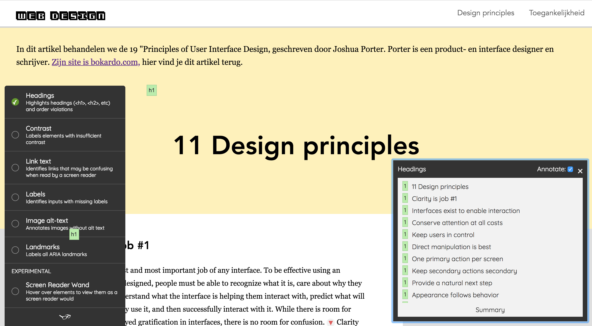
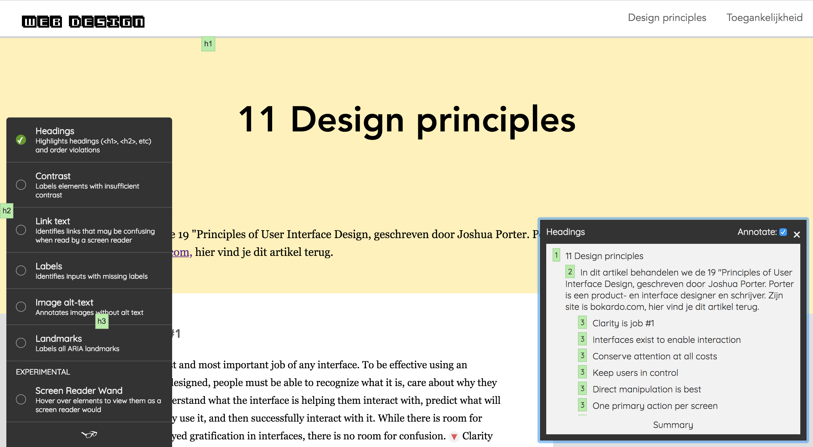

# Web design website

I created this page to present a summary of the entire subject of Web Design in the Everything Web minor.

## Exlusive Design
To test the practice of exclusive design, we design the website specifically for two people.

### Larissa
The first user is Larissa. She's 24, paralympic champion and accessibility expert. She's blind and a frequent internet user. She's daily online, for buisiness or social media. 

#### Job stories 
* I want the HTML structure be that good, that my screen reader can work without any problems and give me an accurage image of the web page.
* I want a website of which I rapidly understand what the subjects are and how to navigate between them
* I don't want to be interrupted by decorative images, spans or other things that don't apply to me

### Doris
My second user is Doris. She's 23 and just graduated as a web developer. She's on this site because she didn't follow the subject at school -or any design subjects for that matter- and wants to learn about it. In her free time she browses the site to understand the subjects.

#### Job stories
* I want clear info before I navigate, because the jargon is new for me.
* I want the option to read deeper into the matter or get some background info since I'm new to design.
* I want to read continiously without too much distraction.
* I want a logical structure of the info, so that it's like I'm taking a couse.
* I want the website to interest me in web design and get me motivated.

## Testing Larissa

### To Do
- [ ] Make a usability page
    - [ ] Summary about sorting/filtering
    - [ ] Background info Informatie Architectuur
    - [ ] Summary on feedback from the slides
- [ ] Home page (basically everything)
- [ ] Header styling because it sucks
- [ ] Styling buttons
- [ ] Toegankelijkheids page add about exclusive inclusive design
- [ ] Back button